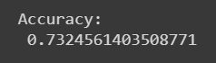

# Liver Cirrhosis Analysis & Prediction
## About Liver Cirrhosis
* Chronic liver damage from a variety of causes leading to scarring and liver failure.
* Hepatitis and chronic alcohol abuse are frequent causes.
* Liver damage caused by cirrhosis can't be undone, but further damage can be limited.
* Initially patients may experience fatigue, weakness and weight loss.
* During later stages, patients may develop jaundice (yellowing of the skin), gastrointestinal bleeding, abdominal swelling and confusion.
## About the dataset
* This data set contains 416 liver patient records and 167 non liver patient records collected from North East of Andhra Pradesh, India. 
* The "Dataset" column is a class label used to divide groups into liver patient (liver disease) or not (no disease). 
* This data set contains 441 male patient records and 142 female patient records.

* Any patient whose age exceeded 89 is listed as being of age "90".
## Program
## Importing Modules

```py
import pandas as pd
import numpy as np
import matplotlib.pyplot as plt
import seaborn as sns
from sklearn.preprocessing import MinMaxScaler
from sklearn.model_selection import train_test_split
from sklearn.metrics import accuracy_score,classification_report,confusion_matrix
from sklearn.linear_model import LogisticRegression
```

## Data Pre-Processing

```py
df = pd.read_csv("/content/drive/MyDrive/Colab Notebooks/Semester 3/19AI403 _Intro to DS/Mini_Project/Liver.csv")
df
df.head()
df.info()
df.describe()
df.tail()
df.shape
df.columns

df.duplicated()
df.duplicated().sum()
df[df.duplicated()]
df=df.drop_duplicates()
df.duplicated().sum()

df.isnull().sum()
df['Albumin_and_Globulin_Ratio'] = df['Albumin_and_Globulin_Ratio'].fillna(df['Albumin_and_Globulin_Ratio'].mean())
df.isnull().sum()

df['Dataset']=df['Dataset'].map({1:1,2:0})

from sklearn.preprocessing import LabelEncoder
le = LabelEncoder()
df["Gender"] = le.fit_transform(df["Gender"])

df
```
### Dataset

## Detecing & Removing Outliers

```py
df.drop('Dataset',axis=1).plot(kind='box',layout=(2,5),subplots=True,figsize=(12,6))
plt.show()

q1=df['Total_Bilirubin'].quantile(0.25)
q3=df['Total_Bilirubin'].quantile(0.75)
iqr=q3-q1
df['Total_Bilirubin']=df['Total_Bilirubin'].apply(lambda x : q1-(1.5*iqr) if x<q1-(1.5*iqr) else x).apply(lambda x : q3+(1.5*iqr) if x>q3+(1.5*iqr) else x)

q1=df['Direct_Bilirubin'].quantile(0.25)
q3=df['Direct_Bilirubin'].quantile(0.75)
iqr=q3-q1
df['Direct_Bilirubin']=df['Direct_Bilirubin'].apply(lambda x : q3+(1.5*iqr) if x>q3+(1.5*iqr) else x).apply(lambda x : q1-(1.5*iqr) if x<q1-(1.5*iqr) else x)

q1=df['Alkaline_Phosphotase'].quantile(0.25)
q3=df['Alkaline_Phosphotase'].quantile(0.75)
iqr=q3-q1
df['Alkaline_Phosphotase']=df['Alkaline_Phosphotase'].apply(lambda x : q3+(1.5*iqr) if x>q3+(1.5*iqr) else x).apply(lambda x : q1-(1.5*iqr) if x<q1-(1.5*iqr) else x)


q1=df['Alamine_Aminotransferase'].quantile(0.25)
q3=df['Alamine_Aminotransferase'].quantile(0.75)
iqr=q3-q1
df['Alamine_Aminotransferase']=df['Alamine_Aminotransferase'].apply(lambda x : q3+(1.5*iqr) if x>q3+(1.5*iqr) else x).apply(lambda x : q1-(1.5*iqr) if x<q1-(1.5*iqr) else x)


q1=df['Aspartate_Aminotransferase'].quantile(0.25)
q3=df['Aspartate_Aminotransferase'].quantile(0.75)
iqr=q3-q1
df['Aspartate_Aminotransferase']=df['Aspartate_Aminotransferase'].apply(lambda x : q3+(1.5*iqr) if x>q3+(1.5*iqr) else x).apply(lambda x : q1-(1.5*iqr) if x<q1-(1.5*iqr) else x)


q1=df['Total_Protiens'].quantile(0.25)
q3=df['Total_Protiens'].quantile(0.75)
iqr=q3-q1
df['Total_Protiens']=df['Total_Protiens'].apply(lambda x : q3+(1.5*iqr) if x>q3+(1.5*iqr) else x).apply(lambda x : q1-(1.5*iqr) if x<q1-(1.5*iqr) else x)


q1=df['Albumin_and_Globulin_Ratio'].quantile(0.25)
q3=df['Albumin_and_Globulin_Ratio'].quantile(0.75)
iqr=q3-q1
df['Albumin_and_Globulin_Ratio']=df['Albumin_and_Globulin_Ratio'].apply(lambda x : q3+(1.5*iqr) if x>q3+(1.5*iqr) else x).apply(lambda x : q1-(1.5*iqr) if x<q1-(1.5*iqr) else x)

df.drop('Dataset',axis=1).plot(kind='box',layout=(2,5),subplots=True,figsize=(12,6))
plt.show()
```
### Before removing outliers


### After removing outliers


## Heatmap

```py
plt.figure(figsize=(10,6))
sns.heatmap(df.corr(),cmap='magma',annot=True)
plt.show()
```


## Correlation

```py
plt.figure(figsize=(10,5))
df.corr()['Dataset'].sort_values(ascending=False).plot(kind='bar',color='black')
plt.xticks(rotation=90)
plt.xlabel('Variables in the Data')
plt.ylabel('Correlation Values')
plt.show()
```


## EDA

* We have 10 independent variables to predict the class (y-variable).
* The class contains binary values either 0 or 1. 
* Notation 0 stands for non-liver patients and 1 stands for people with liver disease.
* We have data of 416 people with liver problem and 167 people without liver problem

```py
df['Dataset'].value_counts()
```


```py
asc = df["Age"].value_counts().sort_values(ascending=False).index

plt.figure(figsize = (18,6))
sns.countplot(data=df,x=df["Age"],hue = df["Dataset"],order=asc)
plt.title('Count across Age',fontsize=16)
plt.show()
```


```py
plt.figure(figsize=(9,6))
df['Gender'].value_counts().plot(kind='pie',autopct='%.2f%%',colors=['goldenrod','dimgray'],explode=(0,0.2),shadow=True)
label=['Male','Female']
plt.title('Percentage difference in the count between Male and Female')
plt.legend(label,title='Category')
plt.show()
```


```py
plt.figure(figsize=(9,6))
df['Dataset'].value_counts().plot(kind='pie',autopct='%.2f%%',colors=['deepskyblue','lawngreen'],explode=(0,0.2),shadow=True)
plt.title('Percentage difference in the count between Healthy & Diseased')
plt.show()
```


```py
sns.countplot(df['Dataset'],palette='Set2')
plt.title('Count Across Disease')
plt.show()
```


```py
sns.countplot(x="Dataset", hue="Gender", data=df)
```


```py
plt.style.use("seaborn")
fig, ax = plt.subplots(figsize=(8,6))
plt.margins(x=0)
plt.title('Histogram for Age with Disease')
sns.histplot(x = df["Age"], hue = df["Dataset"], palette="winter_r", kde=True)
```


1. People starts to get the Liver Disease from the age of 25 to 50 
2. There is chances because of the youngster consuming lot of junk food and Processed foods. 
3. May be also there is possibilty No taking proper food at proper time

## Relationship

### Direct_Bilirubin vs Total_Bilirubin

```py
g = sns.FacetGrid(df, col="Gender", row="Dataset", margin_titles=True)
g.map(plt.scatter,"Direct_Bilirubin", "Total_Bilirubin", edgecolor="w")
plt.subplots_adjust(top=0.9)
sns.jointplot("Total_Bilirubin", "Direct_Bilirubin", data=df, kind="reg")
```


There seems to be direct relationship between Total_Bilirubin and Direct_Bilirubin.

### Aspartate_Aminotransferase vs Alamine_Aminotransferase

```py
g = sns.FacetGrid(df, col="Gender", row="Dataset", margin_titles=True)
g.map(plt.scatter,"Aspartate_Aminotransferase", "Alamine_Aminotransferase",  edgecolor="w")
plt.subplots_adjust(top=0.9)
sns.jointplot("Aspartate_Aminotransferase", "Alamine_Aminotransferase", data=df, kind="reg")
```


There is linear relationship between Aspartate_Aminotransferase and Alamine_Aminotransferase and the gender.

### Alkaline_Phosphotase vs Alamine_Aminotransferase

```py
g = sns.FacetGrid(df, col="Gender", row="Dataset", margin_titles=True)
g.map(plt.scatter,"Alkaline_Phosphotase", "Alamine_Aminotransferase",  edgecolor="w")
plt.subplots_adjust(top=0.9)
sns.jointplot("Alkaline_Phosphotase", "Alamine_Aminotransferase", data=df, kind="reg")
```


No linear correlation between Alkaline_Phosphotase and Alamine_Aminotransferase

### Total_Protiens vs Albumin

```py
g = sns.FacetGrid(df, col="Gender", row="Dataset", margin_titles=True)
g.map(plt.scatter,"Total_Protiens", "Albumin",  edgecolor="w")
plt.subplots_adjust(top=0.9)
sns.jointplot("Total_Protiens", "Albumin", data=df, kind="reg")
```

There is linear relationship between Total_Protiens and Albumin and the gender.

### Albumin vs Albumin_and_Globulin_Ratio

```py
g = sns.FacetGrid(df, col="Gender", row="Dataset", margin_titles=True)
g.map(plt.scatter,"Albumin", "Albumin_and_Globulin_Ratio",  edgecolor="w")
plt.subplots_adjust(top=0.9)
sns.jointplot("Albumin_and_Globulin_Ratio", "Albumin", data=df, kind="reg")
```


There is linear relationship between Albumin_and_Globulin_Ratio and Albumin.

From the above jointplots and scatterplots, we find direct relationship between the following features:
1. Direct_Bilirubin & Total_Bilirubin
2. Aspartate_Aminotransferase & Alamine_Aminotransferase
3. Total_Protiens & Albumin
4. Albumin_and_Globulin_Ratio & Albumin

## Applying ML
### Assinging X and Y
```py
X = df.drop(['Dataset'], axis=1)
y = df['Dataset']
```
### Normalization
```py
scaler=MinMaxScaler()
scaled_values=scaler.fit_transform(X)
X.loc[:,:]=scaled_values
```
#### Before Normalization

#### After Normalization

### Splitting Data 
```py
X_train, X_test, y_train, y_test = train_test_split(X, y, test_size=0.40, random_state=101)
print("Training sample shape =",X_train.shape)
print("Testing sample sample =",X_test.shape)
```

### Applying Logisitc Regression
```py
reg = LogisticRegression()
reg.fit(X_train, y_train)

log_predicted= reg.predict(X_test)
### Measuring accuracy
```py
print('Accuracy: \n', accuracy_score(y_test,log_predicted))
print('Confusion Matrix: \n', confusion_matrix(y_test,log_predicted))
sns.heatmap(confusion_matrix(y_test,log_predicted),annot=True,fmt="d")
print('Classification Report: \n', classification_report(y_test,log_predicted))
```
#### Accuray

#### Confusion Matrix
</br>

#### Classification Matrix


## Predicitng
```py
pred = reg.predict([[22,0,50,10.5,100,120,50,5.0,2.5,1.2]])
if(pred == 1):
  print("Infected with Liver Cirrohisis")
else:
  print("Not Infected with Liver Cirrohisis")
```

